# 🖼️ Glance - ESP32 E-Ink Display System

> A battery-powered ESP32 e-ink display that fetches images from a local Raspberry Pi server with intelligent power management and remote control.

**[🌐 Try the Live Demo](https://chaerem.github.io/Glance/)** - Interactive web interface preview with mock data

## ✨ Features

🔋 **Ultra-Low Power** - Months of battery life with deep sleep cycles
🎨 **6-Color Display** - Beautiful Spectra 6 e-paper technology
📡 **OTA Updates** - Wireless firmware updates with automatic rollback protection
🤖 **AI Art Generation** - GPT-4o powered artwork optimized for e-ink displays
🔍 **Semantic Visual Search** - CLIP-powered search by vibe, not keywords
✨ **Visual Similarity** - "More like this" finds artworks with 0.73-0.84 similarity
🎯 **Personalized Recommendations** - Taste profile learns from your interactions
🖼️ **Personal Gallery** - Unified collection of generated, uploaded, and saved artworks
📱 **Minimal Web Interface** - Clean, calm design for creating and exploring art
🌐 **Local First** - Runs on your Raspberry Pi, no cloud dependencies
🐳 **Docker Ready** - Easy server deployment with published Docker images

## 🏗️ Architecture

```
┌─────────────────┐    WiFi     ┌─────────────────┐
│                 │◄───────────►│                 │
│     ESP32       │             │  Raspberry Pi   │
│   (Display)     │    HTTP     │    (Server)     │
│                 │             │                 │
└─────────┬───────┘             └─────────────────┘
          │ SPI                          │
          ▼                              │ Port 3000
┌─────────────────┐                      ▼
│  Waveshare      │               ┌─────────────────┐
│  13.3" E-Ink    │               │  Web Dashboard  │
│  Spectra 6      │               │                 │
└─────────────────┘               └─────────────────┘
```

**How it works:**
1. ESP32 wakes from deep sleep every 1-6 hours
2. Connects to WiFi and fetches current image from Raspberry Pi server
3. Updates the e-ink display with new content
4. Reports battery status and device health
5. Enters deep sleep until next scheduled wake-up

## 🛠️ Hardware Requirements

| Component | Model | Purpose |
|-----------|-------|---------|
| **Controller** | Good Display ESP32-133C02 | ESP32-S3 with QSPI interface |
| **Display** | Waveshare 13.3" Spectra 6 | 1200×1600 6-color e-paper |
| **Server** | Raspberry Pi 3/4/Zero 2W | Local server hosting |
| **Battery** | LiPo 12,000mAh (PiJuice) | Months of battery life |
| **Power Mgmt** | LiPo Amigo Pro + MiniBoost | Charging + 5V boost |

### 🔌 ESP32 to Display Connections (Good Display ESP32-133C02)

| GPIO | Function | Notes |
|------|----------|-------|
| 18   | SPI_CS0  | Chip select 0 |
| 17   | SPI_CS1  | Chip select 1 |
| 9    | SPI_CLK  | SPI clock |
| 41   | SPI_Data0 | QSPI data line 0 |
| 40   | SPI_Data1 | QSPI data line 1 |
| 39   | SPI_Data2 | QSPI data line 2 |
| 38   | SPI_Data3 | QSPI data line 3 |
| 7    | EPD_BUSY | Display busy signal (input) |
| 6    | EPD_RST  | Display reset (output) |
| 45   | LOAD_SW  | Load switch control |
| 2    | BATTERY  | Battery ADC via voltage divider |

## 🚀 Quick Start

### 1. 🥧 Deploy Server (Raspberry Pi)

**Option A: One-command deploy**
```bash
./deploy-to-pi.sh serverpi.local your-dockerhub-username
```

**Option B: Manual Docker deploy**
```bash
# On your Raspberry Pi
docker run -d \
  --name glance-server \
  -p 3000:3000 \
  -v $(pwd)/data:/app/data \
  --restart unless-stopped \
  your-username/glance-server:latest
```

### 2. 🌐 Configure via Web Dashboard

Access the dashboard at: `http://your-pi-ip:3000`

**New to Glance?** [Try the interactive demo](https://chaerem.github.io/Glance/) to explore the interface with mock data.

**Three Simple Modes:**
- **Create** - Generate AI artwork or upload images
- **Explore** - AI-powered search across **8 museum sources** with 2+ million artworks
- **My Collection** - View all your generated, uploaded, and saved artworks

**Museum Sources:** Met Museum, Art Institute of Chicago, Cleveland Museum, Rijksmuseum, Wikimedia Commons, Victoria & Albert Museum, Harvard Art Museums*, Smithsonian* (*API key required)

The interface follows calm design principles - minimalistic and distraction-free.

### 3. 🔧 Setup ESP32 Client

```bash
# Clone repository
git clone https://github.com/your-username/Glance.git
cd Glance/esp32-client/

# Set WiFi credentials
export WIFI_SSID="YourWiFiNetwork"
export WIFI_PASSWORD="YourWiFiPassword"
export DEVICE_ID="esp32-001"  # Optional: unique device ID

# Build and upload firmware
./build.sh
```

### 4. 🔋 Deploy Device

1. Connect LiPo battery to ESP32 BAT pin
2. Verify display shows test pattern or fetched image
3. Check web dashboard shows device as "online"
4. System now runs autonomously!

## 🔄 Operation Cycle

```mermaid
graph LR
    A[😴 Deep Sleep<br/>~10μA] --> B[⏰ Wake Up<br/>RTC Timer]
    B --> C[📶 WiFi Connect<br/>2-3 seconds]
    C --> D[📥 Check Commands<br/>Remote control]
    D --> E[📷 Fetch Image<br/>From server API]
    E --> F[🖼️ Update Display<br/>30-45 seconds]
    F --> G[📊 Report Status<br/>Battery, signal]
    G --> H[💤 Calculate Sleep<br/>Server controlled]
    H --> A
```



## 📡 API Endpoints

The ESP32 communicates with these server endpoints:

- **`GET /api/current.json`** - Fetch current image and sleep duration
- **`POST /api/device-status`** - Report device health (battery, signal, firmware version)
- **`GET /api/firmware/version`** - Check for available firmware updates
- **`GET /api/firmware/download`** - Download firmware binary for OTA update
- **`POST /api/logs`** - Send device logs to server
- **`GET /api/commands/:deviceId`** - Check for pending remote commands

## 🎛️ Remote Control & Monitoring

Send commands to sleeping devices via web dashboard:

- **📱 Stay Awake** - Keep device active for 5 minutes for debugging
- **🔄 Force Update** - Trigger immediate display refresh
- **📊 View Logs** - Real-time ESP32 serial output
- **🔋 Battery Monitor** - Track voltage, charging status, and battery history
- **📡 OTA Updates** - Deploy firmware updates wirelessly with automatic rollback
- **📈 Device Stats** - Monitor wake cycles, display updates, brownouts, and firmware version

## 📁 Project Structure

```
Glance/
├── README.md              # This file
├── CLAUDE.md              # Claude Code instructions
├── docker-compose.yml     # Local development
├── deploy-to-pi.sh        # Raspberry Pi deployment script
│
├── docs/                  # 📚 Documentation
│   ├── DESIGN.md          # Design principles & philosophy
│   ├── SECURITY.md        # Security guidelines
│   ├── DEPLOYMENT.md      # Deployment instructions
│   ├── HARDWARE.md        # Hardware documentation
│   └── PROJECT_GOALS.md   # Project goals & roadmap
│
├── esp32-client/          # 🔧 ESP32 Firmware (Arduino)
│   ├── src/main.cpp       # Main production firmware
│   ├── lib/epd/           # E-ink display drivers
│   └── build.sh           # Build & upload script
│
├── server/                # 🖥️ Node.js Server
│   ├── server.js          # Express.js entry point
│   ├── routes/            # API route handlers (9 modules)
│   ├── services/          # Business logic (7 modules)
│   ├── utils/             # Shared utilities (3 modules)
│   ├── public/            # Web interface
│   │   ├── index.html     # Main template
│   │   ├── css/           # Stylesheets
│   │   └── js/            # Modular JavaScript
│   ├── __tests__/         # Test suite (188 tests)
│   └── Dockerfile         # Container build
│
├── hardware/              # 🔌 PCB Design (KiCad)
│   └── Glance.kicad_*     # Circuit board files
│
└── scripts/               # 🚀 Automation
    ├── build-and-push.sh  # Docker Hub publishing
    └── update-glance.sh   # Update helper
```

## 🎨 Image Processing & AI Art

### Image Processing
- **🌈 6-Color Optimization** - Automatic conversion to Spectra 6 palette (black, white, yellow, red, blue, green)
- **✨ Floyd-Steinberg Dithering** - Professional quality color mapping for art reproduction
- **📦 Server-Side Processing** - Reduces ESP32 memory usage
- **✂️ Auto-Crop** - Removes whitespace margins from AI-generated images
- **🔆 Contrast Enhancement** - Optimizes images for e-ink characteristics
- **🔄 Rotation Support** - 0°, 90°, 180°, or 270° rotation
- **📺 Full Resolution** - 1150×1550 pixels (93% screen coverage)

### AI Art Generation & Exploration
- **🤖 GPT-4o Integration** - Generate custom artwork via OpenAI image models
- **🔍 Smart Search** - Natural language queries interpreted by AI ("peaceful blue paintings")
- **🏛️ 8 Museum Sources** - Met, ARTIC, Cleveland, Rijksmuseum, Wikimedia, V&A, Harvard*, Smithsonian*
- **🌍 2M+ Artworks** - Search across millions of public domain artworks simultaneously
- **📜 Prompt History** - View the original prompt used to generate any artwork
- **🎨 E-Ink Optimized** - AI prompts emphasize full-bleed, high-contrast compositions
- **💾 Personal Collection** - Unified view of generated, uploaded, and saved artworks

### Semantic Visual Search (CLIP-Powered)
- **🎯 Search by Vibe** - "peaceful blue water" finds Japanese winter landscapes, not keyword matching
- **✨ Visual Similarity** - "More like this" finds artworks with 0.73-0.84 similarity accuracy
- **🧠 Personalized Recommendations** - Taste profile learns from your interactions (likes weighted 2x)
- **⚡ Local & Fast** - CLIP ViT-B/32 runs locally (~600MB cached), ~200ms searches, no API costs
- **📈 Scalable Collection** - Start with 105 artworks, easily scale to 1000-5000

**Scale Up Your Collection:**
```bash
cd server
# Requires Qdrant running: docker run -d -p 6333:6333 qdrant/qdrant
node scripts/populate-from-museums.js 100   # Add 200 artworks (100/museum)
node scripts/populate-from-museums.js 500   # Scale to 1000 artworks (500/museum)
```

## 📊 Performance & Power

| Metric | Value | Notes |
|--------|-------|-------|
| **Display Resolution** | 1150×1550px | 93% screen area |
| **Refresh Time** | 30-45 seconds | Full 6-color update |
| **Deep Sleep Current** | ~10μA | Months of battery life |
| **Active Current (WiFi On)** | ~460mA @ 5V | Peak during display refresh |
| **Active Current (WiFi Off)** | ~250-300mA @ 5V | Display-only operation |
| **Wake-up Time** | 2-3 seconds | WiFi connection ready |
| **Battery Life** | 3-6 months | 3000mAh LiPo, 6-hour cycle |

### 🔋 Battery Optimization & Monitoring

The firmware includes intelligent power management and monitoring:
- **WiFi Auto-Shutdown**: Automatically disables WiFi during display refresh to save ~160-210mA
- **Row-by-Row Updates**: 1ms delays between display rows for stable power draw
- **Progressive Delays**: Strategic pauses between driver ICs to prevent voltage sag
- **Battery Monitoring**: Real-time voltage tracking via GPIO 2 (calibrated 4.7:1 voltage divider)
- **Charging Detection**: Automatic detection when battery voltage >= 4.0V
- **Brownout Protection**: Recovery mode after 3 brownouts to prevent boot loops
- **Smart OTA**: Only performs firmware updates when battery >= 3.6V or charging
- **Median Filtering**: 20-sample ADC readings reject electrical noise outliers
- **Verified with KCX-017**: Tested at 460mA peak with WiFi on, 250-300mA with WiFi off
- **Works on Battery**: Successfully operates on PowerBoost 1000C + LiPo battery

### 🧪 Worst-Case Test Images

Power consumption varies by image complexity. Test images are included in `server/data/`:
- **`test-1-checkerboard-worst-case.png`** - Maximum power draw (all pixels change)
- **`test-2-solid-blue.png`** → **`test-3-solid-yellow.png`** - Full color shift test
- **`test-4-color-stripes.png`** - All 6 colors displayed
- **`test-5-fine-lines-extreme.png`** - Highest frequency pattern

If your battery setup works with `test-1-checkerboard-worst-case.png`, all normal images will work reliably.

## 🔧 Development

### Server Development
```bash
cd server/
npm install
npm run dev      # Auto-reload development
npm test         # Run test suite
npm run coverage # Test coverage report
```

### ESP32 Development
```bash
cd esp32-client/
./build.sh compile  # Build only
./build.sh upload   # Build + upload + monitor
./build.sh monitor  # Serial monitor only
./build.sh clean    # Clean build files
```

## 💾 Persistent Storage & Data Management

Glance uses a multi-layered storage architecture for reliable data persistence:

### Storage Architecture

**SQLite Database** (`data/embeddings.db`)
- Artwork metadata and embeddings
- User interaction history (likes, displays, skips)
- Personalized taste profiles
- 768-dimensional SigLIP embeddings for recommendations

**Qdrant Vector Database** (Port 6333)
- High-performance vector similarity search
- 512-dimensional CLIP embeddings
- Semantic search by natural language
- Visual similarity matching

**JSON Files** (`data/`)
- `current.json` - Current display image (7.4 MB with base64 RGB data)
- `playlist.json` - Automated playlist configuration
- `my-collection.json` - User's saved artwork collection
- `collections.json` - Collection metadata
- `user-interactions.json` - Recent interaction history

**File Storage** (`uploads/`)
- User-uploaded images
- Processed artwork files

### Docker Compose Setup

The `docker-compose.yml` includes persistent volumes for all data:

```yaml
services:
  glance-server:
    volumes:
      - glance-data:/app/data              # SQLite + JSON files
      - glance-uploads:/app/uploads        # User uploads
      - huggingface-cache:/root/.cache/huggingface  # ML models (~600MB)
    environment:
      - QDRANT_URL=http://qdrant:6333
      - HF_TOKEN=${HF_TOKEN:-}            # Optional: Hugging Face API
    depends_on:
      - qdrant

  qdrant:
    image: qdrant/qdrant:latest
    ports:
      - "6333:6333"                        # REST API
      - "6334:6334"                        # gRPC (optional)
    volumes:
      - qdrant-storage:/qdrant/storage    # Vector database

volumes:
  glance-data:
  glance-uploads:
  qdrant-storage:
  huggingface-cache:
```

### Storage Initialization

Verify and initialize storage:

```bash
cd server/
npm run init:storage
```

This command will:
- Create necessary data directories
- Initialize SQLite database with proper schema
- Verify Qdrant connection
- Report storage statistics and file sizes

**Output example:**
```
✓ Directory exists: /app/data
✓ SQLite database initialized
  - Total artworks: 1,247
  - With embeddings: 1,247
  - Coverage: 100%
✓ Qdrant connection successful
  - Total artworks indexed: 1,247
  - Vector size: 512
💾 Storage Status Report
  Data Directory: 14.2 MB
  Uploads Directory: 42.8 MB (15 files)
```

### Data Persistence Strategy

**Local Development:**
```bash
# Data stored in ./server/data/ and ./server/uploads/
npm start
```

**Docker Deployment:**
```bash
# Named volumes persist across container restarts
docker-compose up -d

# View volume locations
docker volume inspect glance_glance-data
docker volume inspect glance_qdrant-storage
```

**Backup Strategy:**
```bash
# Backup SQLite database
docker cp glance-server:/app/data/embeddings.db ./backup/

# Backup all data
docker run --rm \
  -v glance_glance-data:/data \
  -v $(pwd)/backup:/backup \
  alpine tar czf /backup/glance-data.tar.gz -C /data .

# Backup Qdrant
docker run --rm \
  -v glance_qdrant-storage:/qdrant \
  -v $(pwd)/backup:/backup \
  alpine tar czf /backup/qdrant-storage.tar.gz -C /qdrant .
```

### Environment Variables

**Required:**
- `OPENAI_API_KEY` - For AI art generation (optional if not using AI features)

**Optional:**
- `HF_TOKEN` - Hugging Face API token for SigLIP embeddings (falls back to local CLIP)
- `QDRANT_URL` - Qdrant server URL (default: `http://localhost:6333`)
- `PORT` - Server port (default: 3000)
- `NODE_ENV` - Environment mode (production/development)

### Populating the Vector Database

Index artworks from various sources:

```bash
cd server/

# Index from JSON collection
node scripts/populate-qdrant.js path/to/artworks.json

# Index WikiArt dataset
node scripts/populate-qdrant-wikiart.js

# Fetch and index from museums
node scripts/populate-from-museums.js
```

### Storage Monitoring

**Check database stats via API:**
```bash
# SQLite statistics
curl http://localhost:3000/api/semantic/stats

# Qdrant statistics
curl http://localhost:6333/collections/artworks
```

**Monitor disk usage:**
```bash
# Local development
du -sh server/data server/uploads

# Docker volumes
docker system df -v | grep glance
```

## 🚢 Deployment & Updates

### Automated Deployment
Pushing to `main` branch automatically:
1. Runs full test suite
2. Builds multi-architecture Docker image
3. Deploys to Raspberry Pi via Tailscale SSH
4. Updates running container with zero downtime

### Manual Deployment
```bash
# Deploy specific version
IMAGE_VERSION=abc1234 ./deploy-to-pi.sh serverpi.local your-username

# Check running version
docker exec glance-server env | grep IMAGE_VERSION
```

## 🐛 Troubleshooting

### ESP32 Issues
- **WiFi fails**: Check SSID/password, ensure 2.4GHz network
- **Display blank**: Verify SPI connections, check power supply
- **Won't sleep**: Check for active serial monitor connection
- **Battery drain**: Verify deep sleep current with multimeter

### Server Issues
- **Can't access dashboard**: Check port 3000, firewall settings
- **Images not processing**: Verify Sharp dependencies installed
- **Container won't start**: Check disk space, Docker daemon

### Network Issues
- **ESP32 can't reach server**: Check `serverpi.local` resolution
- **Slow image downloads**: Verify network bandwidth, WiFi signal
- **Commands not working**: Ensure device recently active (within 5 min)

## 🗺️ Roadmap

### ✅ Completed
- [x] ESP32 firmware with ultra-low power management
- [x] Node.js server with modular architecture
- [x] AI art generation with GPT-4o
- [x] AI-powered museum art search
- [x] **Semantic visual search with CLIP** - Find art by vibe, not keywords
- [x] **"More like this"** - Visual similarity search (0.73-0.84 accuracy)
- [x] **Personalized recommendations** - Taste profile learns from interactions
- [x] Personal art collection management
- [x] Clean, minimalistic web interface
- [x] Automated deployment pipeline
- [x] Comprehensive test coverage

### 🔮 Future Ideas
- [ ] Scheduling art for different times of day
- [ ] Battery usage analytics and optimization
- [ ] Multi-device synchronization
- [ ] Collaborative collections

## 📚 Documentation

Detailed documentation is available in the [`docs/`](docs/) directory:

- **[DESIGN.md](docs/DESIGN.md)** - Design principles, UI guidelines, calm technology philosophy
- **[SECURITY.md](docs/SECURITY.md)** - Security best practices, credential management
- **[DEPLOYMENT.md](docs/DEPLOYMENT.md)** - Complete deployment guide (GitHub Actions, Docker, Tailscale)
- **[HARDWARE.md](docs/HARDWARE.md)** - Hardware specifications and wiring diagrams
- **[PROJECT_GOALS.md](docs/PROJECT_GOALS.md)** - Project goals and vision

---

**Ready to build your own smart e-ink display?** 🚀

Start with the [Quick Start](#-quick-start) guide above!
